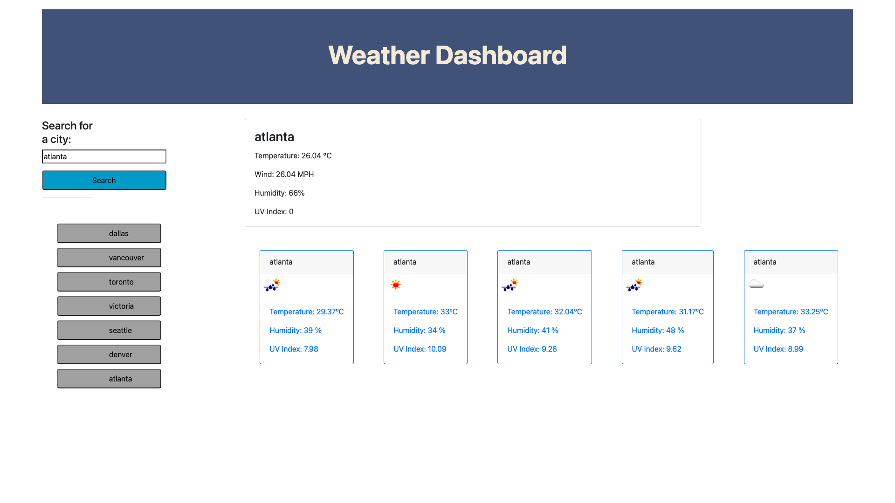

# 06 Server-Side APIs: Weather Dashboard

## Description

This application uses Third-party APIs to access their data and functionality by making requests with specific parameters to a URL. 
A weather dashboard will run in the browser and feature dynamically updated HTML and CSS.

Use the [OpenWeather One Call API](https://openweathermap.org/api/one-call-api) to retrieve weather data for cities. Also, use `localStorage.` 

When searching for a city, I am presented with the city’s current and future conditions, and that city is added to the search history.

Display current weather conditions for that city, including the date, an icon representing weather conditions, the temperature, the humidity, the wind speed, and the UV index, with a color that indicates whether the conditions are favorable, moderate, or severe.

Check for future weather conditions for that city. I am presented with a 5-day forecast that displays the date, an icon representing weather conditions, the temperature, the wind speed, and the humidity.
If I click on a city in the search history, I am again presented with current and future conditions for that city.

## Mock-Up

The following image shows the web application's appearance and functionality:

## Application

Deployed site

